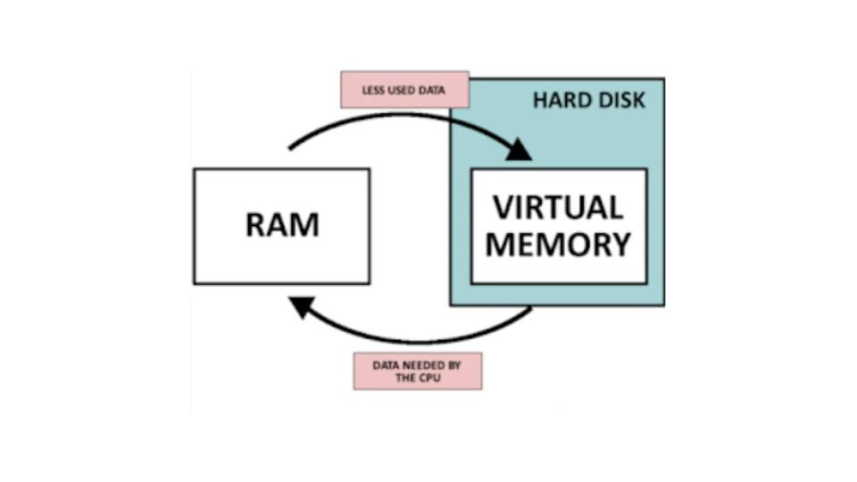
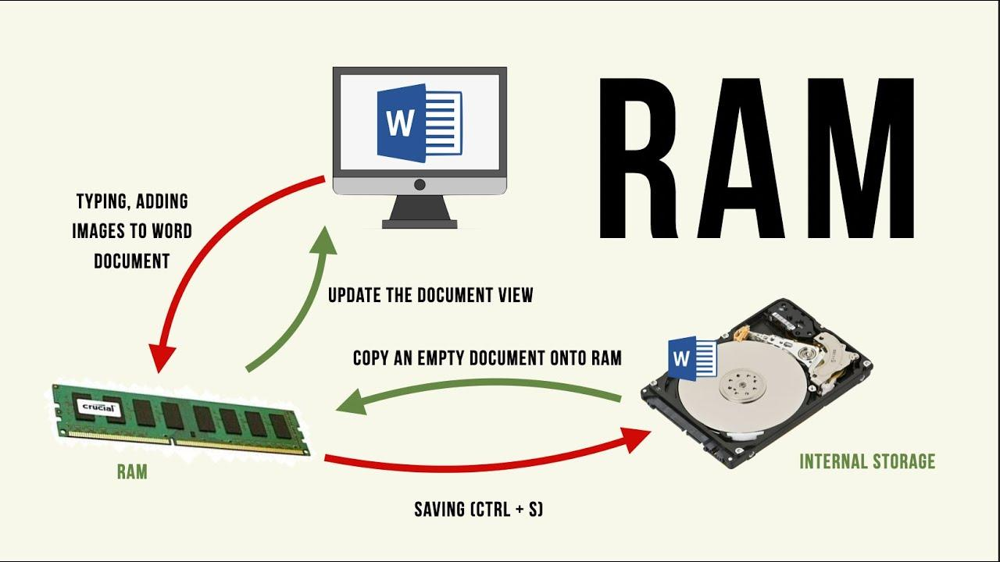
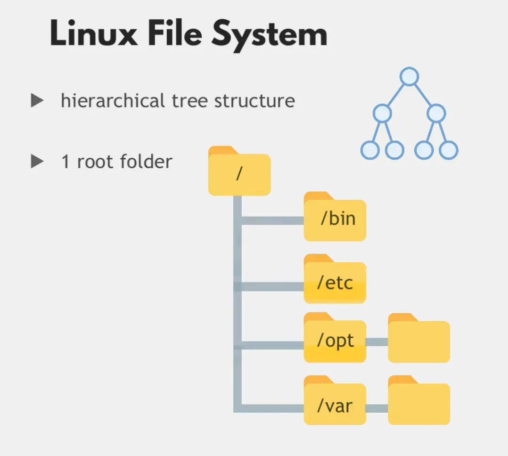
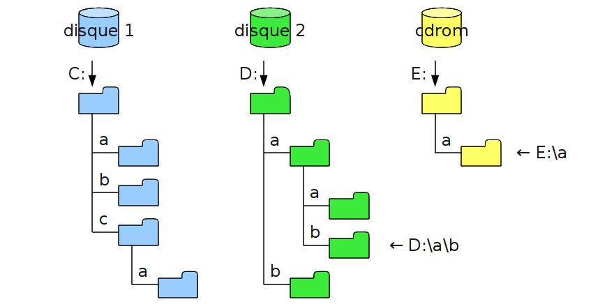
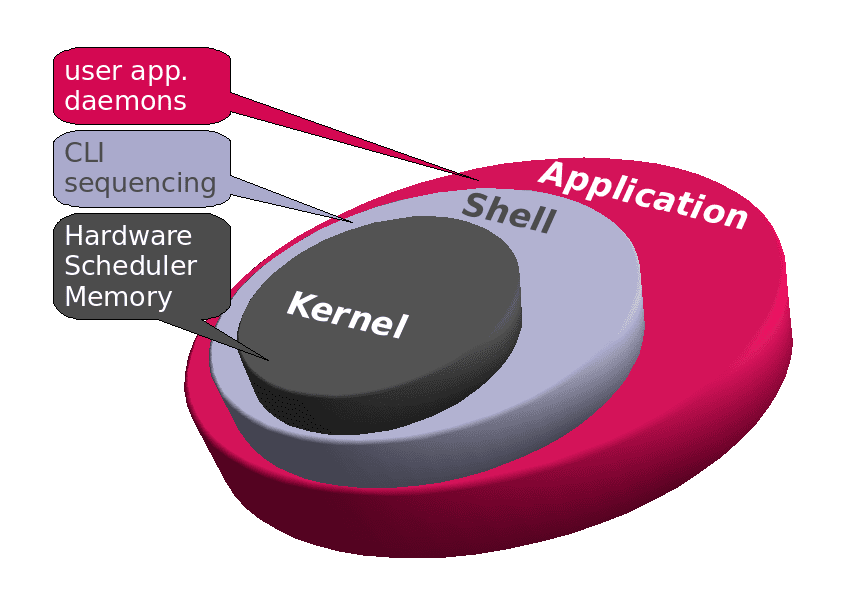
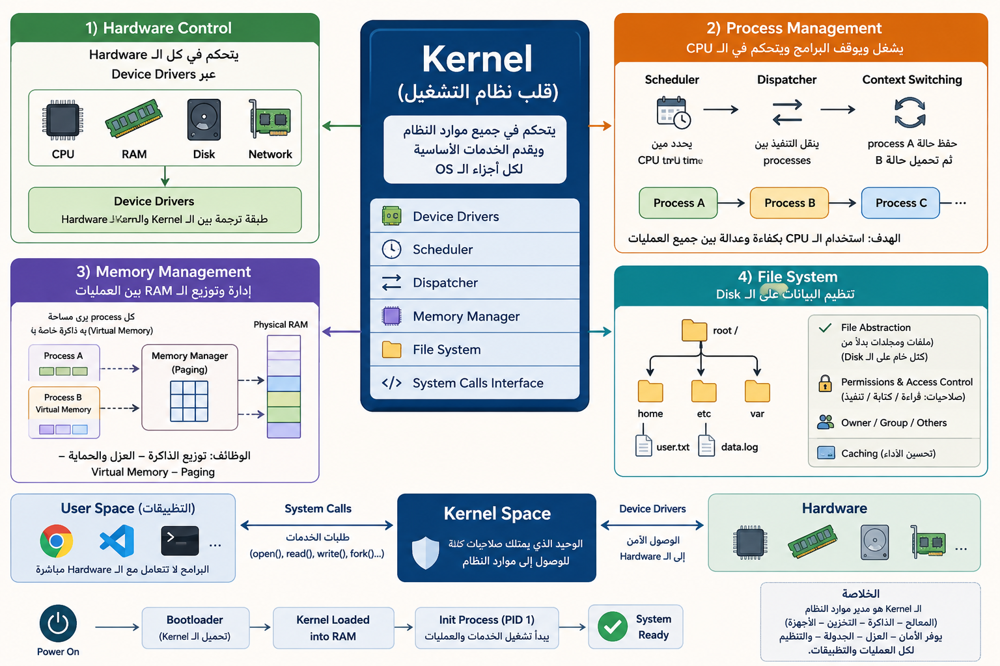
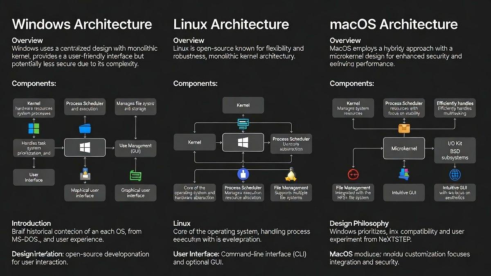

# 01 — Introduction to Operating Systems (مقدمة عن أنظمة التشغيل)

> **التالي:** [02 - Introduction to Virtualization and Virtual Machines](02 - Introduction to Virtualization and Virtual Machines.md)

---

## 1. ما هو نظام التشغيل؟

> [!info] **Operating System (OS) — نظام التشغيل**
> هو برنامج أساسي يعمل كـ **وسيط (Intermediary)** 
> بين المستخدم والـ Hardware (العتاد)، ويدير جميع موارد الحاسوب.

- بدون نظام التشغيل، لا يمكنك تشغيل أي برنامج.
- هو الطبقة التي تجلس **فوق الـ Hardware** وتحت جميع التطبيقات.

---

## 2. طبقات النظام (System Layers)

```

  Applications (تطبيقات)  ← المستخدم يتعامل معها

   Operating System (OS)   ← المدير والوسيط

   Hardware (عتاد)         ← CPU, RAM, Disk...

```

> [!lightbulb] **توضيح: ليش الـ OS وسيط؟**
> تخيل إنك عايز تطبع ملف — التطبيق بيبعت أمر للـ OS، والـ OS هو اللي بيكلم الطابعة فعلياً. ما في تطبيق بيتكلم مع الـ Hardware مباشرة.

---

## 3. المهام الرئيسية للـ OS
### 1. Resource Allocation and Management
#### أ) Process Management (إدارة العمليات)
- الـ **Process** هي: برنامج قيد التشغيل في الذاكرة. // زي تاب , او برنامج
- كل **Process** لها المساحة الخاصة بتاعتها , isolated space
- الــ 1 CPU يقدر يــ process at a time // حاليا فيه dual core , quad core 4
- الـ OS بيقرر مين  بياخد الـ CPU ومتى. (**CPU Scheduling**)
- بيدير الـ **Multitasking** (تشغيل أكثر من برنامج في نفس الوقت).

> [!info] **Process vs Program**
> - الــ **Program:** ملف موجود على الـ Disk (ساكن).
> - الــ **Process:** نفس البرنامج لما بيتحمّل في الـ RAM ويبدأ ينفذ (متحرك).

### ب) Memory Management (إدارة الذاكرة)
- بيوزع الـ **RAM** على البرامج المختلفة.
- بيستخدم تقنية الـ **Virtual Memory** لتعويض نقص الـ RAM.

> [!lightbulb] **Virtual Memory ببساطة:**
> لو عندك RAM 4GB والبرامج محتاجة 6GB، الـ OS بياخد جزء من الـ Hard Disk ويستخدمه كـ RAM مؤقت. بطيء لكن بيحل المشكلة.
> 
> 	Working Memory = RAM 
> 	Virtual Memory = Hard Swap 
> 
> 
> 	RAM >> for your file you're workring on
> 	Hard disk >> Actual location where file saved after 


### ج) File System Management (إدارة نظام الملفات)
- بينظّم الملفات والمجلدات على الـ Storage.
- بيتحكم في **من يقدر يقرأ/يكتب** أي ملف. (Permissions)


> [!info] **File system**  in Windows vs Linux
> * Tree (Single Root)
>-  كل النظام عبارة عن **شجرة واحدة**   , لها **Root واحد فقط**
> كل الملفات مرتبطة ببعض تحت Root واحد - أي Path يبدأ من `/`
> مثال
> Linux / Unix:      
>	    /home/ahmed/file.txt
>	    
>   
>  -- 
> * Multiple Roots
>- عندك **أكتر من Root منفصل**  , كل واحد شجرة مستقلة
>- كل Drive = Root مستقل , مفيش شجرة موحدة
   مثال
> Windows:
	    C:\Users\ahmed
	    D:\Movies\film.mp4   
> 
> 


### د) Device Management (إدارة الأجهزة)
- بيتواصل مع الأجهزة المتصلة عن طريق **Drivers (تعريفات)**.

> [!info] **Driver ( تعريف جهاز خارجي )**
> برنامج صغير بيعرّف الـ OS إزاي يتكلم مع جهاز معين (طابعة، كارت شاشة...).

### هـ) Security & Access Control (الأمان والتحكم في الوصول)
- الـ OS بيدير **User Accounts** (حسابات المستخدمين) وصلاحياتهم.
- كل مستخدم له Space / Permissions
- 
### ذ) مهام اخري - Security / Networking 
* الـ OS بيدير ان يبقي  لــ 
	  - كل User عنده:
Home directory (مساحة خاصة) - UID (User ID) - Groups (صلاحيات مشتركة)
	- كل File/Resource له:
Owner - Permissions (read / write / execute)
* الشبكة مش بتوصل للـ computer بس  
هي بتوصل **لـ process معين داخل الجهاز**  
- IP address = عنوان الجهاز
- Port = عنوان التطبيق داخل الجهاز
%%
#### كيف data بتمشي داخل النظام
1. Incoming packet
- packet يدخل عبر Network Interface Card (NIC)
- OS يستلم packet
2. IP check
- يتأكد: هل هذا الجهاز هو destination IP؟
 3. Port mapping
- يشوف destination port:
    - 80 → HTTP server
    - 443 → HTTPS
    - 22 → SSH
 4. Forward to process
- OS يستخدم socket table
- يربط:
    - (IP + Port) → Process ID (PID) %%
  فالـ OS هو الـ **traffic controller** :
- داخليًا: من يقرأ/يكتب
- خارجيًا: من يستقبل أي data وأين تذهب داخل النظام
---

## 4. أنواع أنظمة التشغيل الشائعة

|     النوع     |         أمثلة          |       الاستخدام الشائع       |
| :-----------: | :--------------------: | :--------------------------: |
|  **Windows**  |     Windows 10, 11     |     سطح المكتب، الشركات      |
|   **Linux**   | Ubuntu, CentOS, Debian | Servers، DevOps، Development |
|   **macOS**   |     macOS Ventura      |      سطح المكتب (Apple)      |
| **Mobile OS** |      Android, iOS      |           الهواتف            |

---

## 5. ليه Linux تحديداً؟

> [!lightbulb] الــ**Linux في عالم الـ Servers**
> أكثر من **90%** من الـ Servers على الإنترنت بتشتغل بـ Linux. 
> لو شغلتك DevOps، Cloud، أو Backend — لازم تعرف Linux.
>- مميزاته : 
>	- **Open Source:** مجاني ومفتوح المصدر.
>	- **Stable & Secure:** مستقر وآمن.
>	- **Lightweight:** ممكن يشتغل على أجهزة قديمة أو ضعيفة.
>	- **Customizable:** تقدر تعدّل فيه زي ما تحب .

---
## 6. مكونات الـ Linux

```

  Applications / Shell    

  Linux Kernel (النواة)     ← القلب الأساسي

  Hardware                

```

> [!info] **Kernel (النواة)**
> 
> هو الجزء الأساسي من الـ OS , بيتحكم مباشرة في الـ Hardware , كل توزيعات Linux بتشترك في نفس الـ Kernel تقريباً. 
> *  الـ **Kernel** هو أول layer فعلي شغال بعد bootloader، وهو المسؤول عن التحكم الكامل في موارد الجهاز.
> * الوظيفة للـ Kernel : 
> 1) Hardware Control
> 2) Process Management
> 3) Memory Management
> 4) File System
> 5) System Calls Interface
> 	* الـ Kernel هو:
		- Resource allocator
		- Hardware abstraction layer
		- Security boundary
		- Execution manager
> في الـ Kernel :  
> Kernel starts the process for app , Allocates resources to app, Cleans up the resources when app shuts town
> بدونه:  
النظام كله يبقى hardware بدون تحكم، والـ processes تبقى عشوائية بدون إدارة

%%
	> 
#### الوظيفة للـ Kernel :
1) Hardware Control
يتحكم في كل الـ hardware عبر Device Drivers
CPU, RAM, Disk, Network كلها لا تُستخدم مباشرة من البرامج
2) Process Management
يشغل ويوقف البرامج:
Scheduler
يحدد مين ياخد CPU time
Dispatcher
ينقل التنفيذ بين processes
context switching
3) Memory Management
توزيع RAM بين processes
حماية memory isolation
virtual memory + paging
4) File System
تنظيم الداتا على disk
permissions + access control
file abstraction بدل raw disk blocks
5) System Calls Interface
البرامج ما تتكلمش مع hardware مباشرة
تتكلم مع kernel عبر syscalls :
open()
read()
write(
fork()
%%

### كيف نتعامل مع الـ Kernel
- Graphical User Interface - GUI 
	  - شائعة اكتر مع windows عشان ال user applications
- Command Line Interface - CLI
	  - شائعة اكتر مع ال linux / server لان مفيش gui / user app

> [!info] Application Layer / **Linux Distribution (توزيعة Linux)** 
> اعلي الــ kernel فيه ال Application Layer واجهة المستخدم
الـ Kernel + مجموعة برامج + واجهة = **Distribution (Distro)**  
> أمثلة:
>  Ubuntu, Fedora, Debian, CentOS, Arch Linux

 - ###  Main Operating Systems
	Linux - Windows - MacOS


 كل OS له نسخ (Distributions / Versions)
Windows: 10, 11, Server editions
Linux: Ubuntu, Fedora, Debian…
macOS: Ventura, Sonoma…

Kernel concept stays the same
1. Windows 
	- Kernel: NT Kernel
بيتطور مع كل إصدار
2. Linux 
	- Kernel: Linux Kernel
نفس الاسم، لكن:
كل version = kernel version مختلف (5.x → 6.x)
3. macOS
	- Kernel: XNU
يتغير مع كل macOS release
فيه additions/removals في drivers + security layer

** محلوظة 
 - ال MacOS مبني علي ال unix لكن الـ kernel بتاعته مختلفة اسمها darwen 
 -  الـ android منبي علي lunix , يعني فيه HW فوقه فيه Linux kernel وبعده طبقة الاندرويد وال user app زي google play apps  
 -  MacOS and Linux: Command Line, File
structure etc. similar
 * Whereas Windows is completely different
 
 ### الفرق بين ال  Client OS vs Server OS
 
1. **Personal Computer OS (Client OS)**
أنظمة موجهة للمستخدم العادي مع GUI :
* الــ Desktop Computers :
	* Windows (Windows 10 / 11)
	* macOS
	* Desktop Linux (Ubuntu Desktop, Fedora Workstation)
أجهزة محمولة أو embedded:
* Android (Linux-based)
* iOS
- خصائص :
		* GUI (Graphical User Interface)
		* User applications
		* Drivers for peripherals
			- Focus: usability + productivity

2. **Server OS**
أنظمة مخصصة للخوادم:
* Linux Server (Ubuntu Server, CentOS/RHEL, Debian Server)
* Windows Server
*  خصائص:
		* No GUI by default (optional) 
		* Headless operation (SSH / remote management)
		* High performance + stability
		* Long uptime
		* Security hardened

---
	  
---
## 7. ملخص سريع

| المفهوم     | المعنى                             |
| ----------- | ---------------------------------- |
| **OS**      | وسيط بين المستخدم والـ Hardware    |
| **Process** | برنامج شغّال في الـ RAM            |
| **Kernel**  | قلب الـ OS، يتحكم في الـ Hardware  |
| **Driver**  | برنامج يعرّف الـ OS بجهاز معين     |
| **Distro**  | Linux + برامج + واجهة مجمّعين معاً |

---

>  **التالي:** [02 - Introduction to Virtualization and Virtual Machines](02 - Introduction to Virtualization and Virtual Machines.md)

---

Notes by. Ahmed Mousa  
شكر خاص  
Eng. [Ahmed Eid](https://www.youtube.com/@a0xEid)
